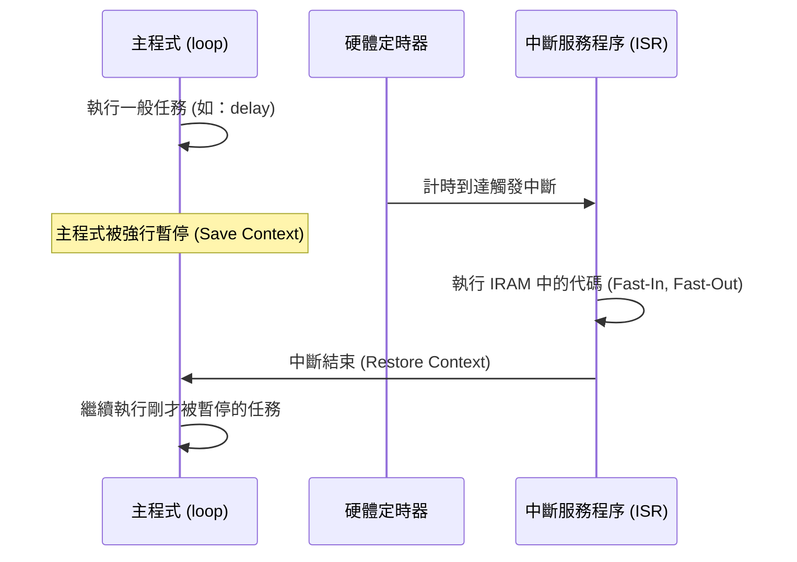

# ISR 中斷流程圖 (ISR Flowchart)

請在此繪製或描述硬體中斷如何「搶佔 (Preempt)」主程式的過程。

## 1. 中斷搶佔示意圖
(你可以使用 Mermaid 語法或上傳圖片)

## 2. ISR 代碼規範檢核表
- [ ] 代碼是否位於 IRAM 中 (`IRAM_ATTR`)？
- [ ] 是否避免了 `Serial.print()`？
- [ ] 是否避免了 `delay()`？
- [ ] 執行時間是否極短？

## 3. 為什麼需要這些規範？
(請在此解釋如果 ISR 執行過久，對系統穩定性的影響)
